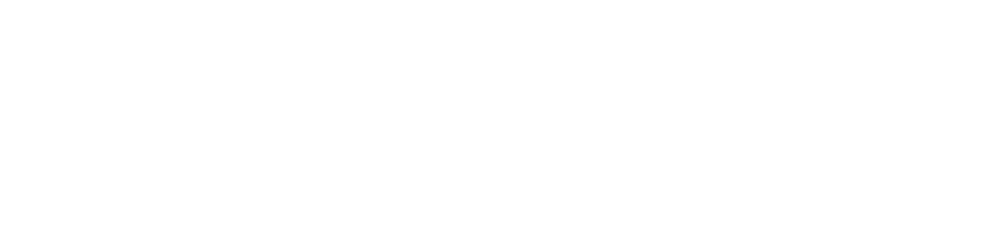

<!--img src="header1.svg" width="50%" height="300" align="left"-->

  California State University San Marcos Computer Science Undergrad with a life-long passion for computer hardware and software.
  I am currently working part-time at DGI Supply as a Junior Web/Software developer while I finish my undergrad at CSU San Marcos.
  I have experience in a wide range of programming languages, including Java, C++, Python, C#, Typescript, Javascript, and many more.
  Feel free to check out some of my repositories here.

